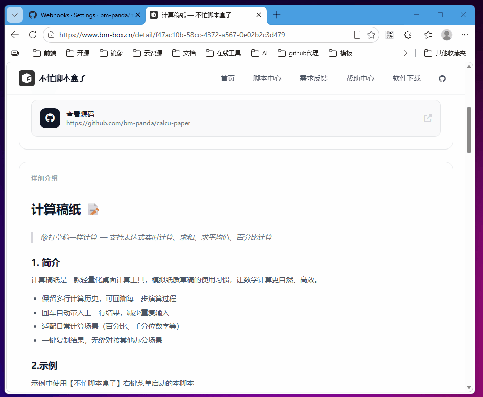

# 搜狗翻译 📝

> 选中文字后快速打开搜狗翻译，无需手动输入

## 1. 简介

在日常阅读或工作中遇到不认识的单词或句子时，无需打开浏览器、复制粘贴三步操作。选中文字后一键直达搜狗翻译网页，结果即时呈现。

- 选中文字后快速复制（双击 Ctrl+C）即触发
- 自动将文字带入搜狗翻译，省去粘贴步骤
- 不中断当前工作流，静默无打扰
- 未选中文字时直接打开搜狗翻译首页

## 2. 示例

选中文本后触发快速复制，自动打开搜狗翻译带参页面

## 3. 快速开始

- **自动安装（推荐）**
  - 下载 [不忙脚本盒子](https://www.bm-box.cn) 后，打开 → 脚本市场 → 搜索「搜狗翻译」→ 点击安装。
  - 盒子会自动配置环境，安装后在浏览器选中文字后双击 Ctrl+C 即可使用。

- **手动安装**
  - 需自行安装 PowerShell 5.1+，在不忙脚本盒子中导入 `bm-scripts-box-rc.toml` 配置文件。

## 4. 启动方式（通过盒子部署）

- **快速复制触发** — 在任意应用中选中文字，快速按两次 Ctrl+C，脚本自动将文字带入搜狗翻译。
- **单击启动** — 打开不忙脚本盒子，在已安装脚本列表找到「搜狗翻译」，单击可打开翻译首页。

## 5. 全部功能一览

| 功能 | 说明 |
|------|------|
| 文字翻译 | 选中文字后自动打开搜狗翻译并带入内容 |
| 翻译首页 | 无选中文字时直接打开搜狗翻译首页 |
| 静默执行 | 无弹窗、无终端，后台打开浏览器 |

## 6. 更新日志

- v0.1.2（当前最新版）
  - 首次发布
