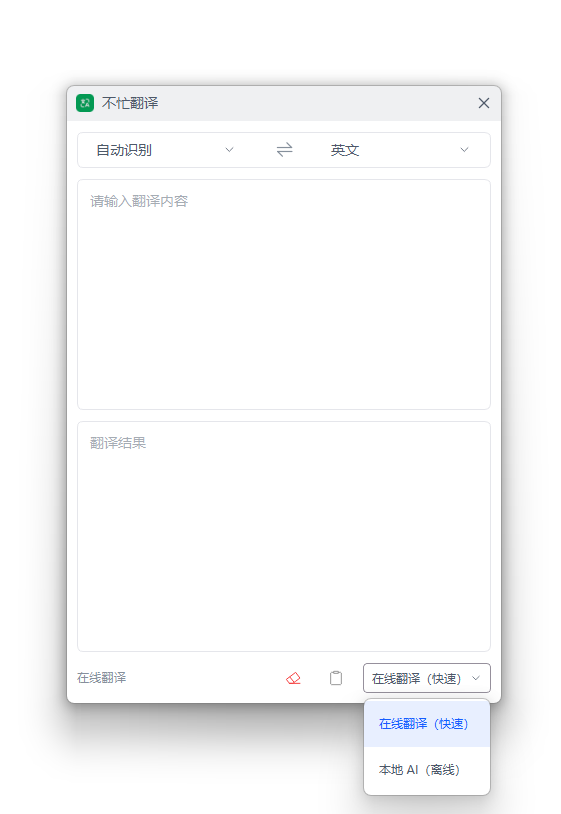

# 不忙翻译

> 基于搜狗在线接口 + 本地腾讯混元 Hy-MT2-1.8B 大模型的双引擎文本翻译工具。在任意应用中复制文字、双击 Ctrl+C 即可唤起右下角贴边小窗，停笔自动出译文，输入英文译中文、输入中文译英文。在线 21 种、离线 38 种语言，断网可用，在线失效自动降级，可作为节点被其他脚本联动调用。

---

## 核心特性

- **双引擎一键切换**：在线翻译秒级返回，本地 AI 完全离线；窗口顶部随时切换，选择会被记住
- **在线引擎**： 通过爬取搜狗翻译 Web 端获取翻译结果
- **离线引擎** ：基于混元 Hy-MT2-1.8B 模型，支持 CPU 推理，无需独立显卡，普通配置电脑即可运行
- **输入即译**：输入停笔自动翻译（在线 0.8 秒、本地 1.2 秒触发），翻译在后台完成，界面不卡
- **边译边显示**：译文逐段刷新，长文不必等整段生成
- **语言自感应**：输入英文自动译成中文，输入中文自动译成英文；也可手动指定，点 ⇄ 一键互换源/目标语言
- **多语种覆盖**：在线 21 种、本地 AI 38 种，下拉框随引擎切换，不会选到当前引擎翻不了的语言
- **贴边小窗**：常驻屏幕右下角最前，目光轻移即可读译文，不占整屏
- **自动降级**：在线接口不可用时自动切到本地模型，并在状态栏明确提示，翻译不中断
- **自动分段**：超出模型上下文的原文自动分块翻译再拼接，不再被截断
- **内存友好**：离开本地引擎时释放 1GB+ 模型内存，切回时重新加载
- **一键复制 / 清空**：复制按钮把译文写入剪贴板；清空按钮同时停掉在途翻译、清掉输入与译文
- **可被脚本调用（节点）**：其他脚本可通过盒子 `/api/link` 联动调用，静默翻译并回传译文，不弹窗口

---

## 脚本演示



---

## 安装方法

本脚本的运行环境、依赖组件及图形化窗口均依赖"不忙脚本盒子"，建议仅通过盒子安装和使用本脚本。

> 前置条件：安装好 [不忙脚本盒子](https://www.bm-box.cn)

* 打开盒子 → **脚本市场** → 搜索 **「不忙翻译」**
* 点击「安装」——如需使用「本地 AI」离线引擎，盒子会自动下载翻译模型（约 1.13GB），请保持网络畅通

---

## 使用方式

### 超级复制启动（推荐）

* 在任意应用（浏览器、PDF、Office 等）中选中要翻译的文字，按 `Ctrl+C` 复制到剪贴板
* 再快速按一次 `Ctrl+C`（双击 `Ctrl+C`）
* 盒子弹出脚本列表 → 点击 **「不忙翻译」**
* 右下角小窗打开，原文已自动填入，停顿后自动开始翻译，译文显示在下方结果框

### 卡片启动

* 在盒子里单击 **「不忙翻译」** 脚本卡片
* 在小窗的「原文」框输入或粘贴文本，停笔后自动翻译

### 语言与引擎设置

* 窗口顶部下拉框切换引擎：**在线翻译（快速）** / **本地 AI（离线）**，选择会被记住，下次打开还是上次那个
* 源语言默认「自动识别」，目标语言默认「中文」；也可手动指定，点 **⇄** 一键互换源/目标语言
* 语种下拉随引擎切换：**仅在线** 芬兰语 / 瑞典语 / 丹麦语 / 匈牙利语；**仅离线** 繁体中文 / 粤语 / 马来语 / 印尼语 / 印地语 / 波斯语 / 藏语 / 哈萨克语 / 蒙古语 / 维吾尔语 等

### 停止与清空

* 想中断正在进行的翻译：清空「原文」框即可，在途翻译立即停止，不会有残文继续冒出
* 点右下角**清空按钮**：一次性清掉输入与译文，回到初始态
* 点右下角**复制按钮**：把译文全文写入剪贴板（没有译文时按钮不可用）

---

## 💡 使用提示

* **首次使用「本地 AI」要等一等**：需要先加载约 1.13GB 的模型，首次加载需数十秒，之后翻译很快。只想要「即装即用、秒回」，直接用「在线翻译」即可，无需下载
* **怎么选引擎**：日常短句、要秒回、能联网 → 在线；需要断网使用，或要翻译繁体中文 / 粤语 / 藏语 / 哈萨克语等在线没有的语言 → 本地 AI
* **两个引擎语种不重合**：本地 AI 共 38 种，其中有 21 种（繁体中文、粤语、藏语、哈萨克语等）在线翻不了，必须切到本地 AI；反过来芬兰语、瑞典语、丹麦语、匈牙利语只有在线支持。下拉框会跟着引擎走，不会让你选到当前引擎翻不了的语言
* **看到状态栏提示就是已自动降级**：在线接口不可用时会自动改用本地模型，并在状态栏明示。若你希望完全离线稳定运行，直接手动切到「本地 AI」
* **内存会回收，别频繁来回切引擎**：切到在线引擎会释放本地模型占用的 1GB+ 内存；切回本地 AI 需要重新加载，频繁切换会反复等待
* **长文不会被截断**：超出模型上下文的原文会自动分块翻译再拼接，长文本可以整段粘贴
* **清空输入框 = 停止翻译**：这是本脚本唯一的「停止」方式，清空后不会有残文继续冒出
* **复制按钮只在有译文时可用**：译文框为空或是错误提示时，复制按钮保持禁用，避免把失败文案粘走

---

## 节点脚本(开发者阅读)

本脚本声明为节点，其他脚本可通过盒子的 `/api/link` 调用；调用期间**不弹窗口**，跑完即退。目标语言不被所选引擎支持时，脚本会**自动换另一个引擎**，返回信封里的 `engine` 如实反映实际使用的引擎。

调用方可传的参数（原文放在 `data.translate_text`，单元素数组）：

| 参数 | 取值 | 默认 |
| --- | --- | --- |
| `engine` | `online` / `offline` | `online` |
| `from_lang` | 自动识别 + 全部 42 种语言名 | 自动识别 |
| `to_lang` | 全部 42 种语言名 | 中文 |

返回信封的业务键：

| 业务键 | 类型 | 说明 |
| --- | --- | --- |
| `translated_text` | str | 译文全文 |
| `engine` | str | **实际**使用的引擎；指定语言不被它支持（或它跑失败）时会自动换另一个 |
| `target_lang` | str | 实际的目标语言 |

联动调用示例：

```python
import json, sys, requests

payload = json.load(open(sys.argv[1], encoding="utf-8"))
api_base = payload["environment"]["api_base"]

FY_ID = "cdc0842f-d628-4395-a644-b7ace9b012b0"  # 本脚本 script_id

r = requests.post(f"{api_base}/api/link", json={
    "script_id": FY_ID,
    "data": {"translate_text": ["Hello, world."]},
    "params": {"engine": "online", "to_lang": "中文"},
}, timeout=600)          # 本地 AI 引擎首次要加载约 1.13GB 模型，超时给足
body = r.json()

if not body.get("success"):
    raise RuntimeError(body.get("message", "联动调用失败"))
result = body["result"]
if result.get("code") != 0:
    raise RuntimeError(result.get("msg"))

print(result["translated_text"])                # 译文全文
print(result["engine"], result["target_lang"])  # 实际用的引擎 / 实际目标语言
```

不装盒子也能自测：把 `environment.invoke_mode` 设为 `"node"`、`environment.output_json` 设成一个可写路径，直接 `python main.py input.json`，跑完去看那个文件里的信封。

---

## 🖥️ 环境要求

| 项目 | 要求 |
| --- | --- |
| **操作系统** | Windows 10+（64 位） |
| **运行环境** | Python 3.10+（盒子自动安装） |
| **离线模型** | 腾讯混元 Hy-MT2-1.8B Q4_K_M（约 1.13GB，安装脚本时由盒子自动下载；仅本地 AI 引擎需要） |

> **手动运行（开发者）**：`pip install pyside6 xsideui`；离线引擎还需 `llama-cpp-python`（仓库 `wheels/` 已带预编译轮子）。环境变量 `FY_MODEL_PATH` 指定模型路径、`FY_N_THREADS` 调离线推理线程数（默认 4）、`FY_NODE_TIMEOUT` 调节点调用超时（默认 300 秒）。

---

## 更新日志

### v2.2.0

- 新增**复制译文**、**清空输入与译文**两个按钮（图标按钮，带悬停提示）
- 语言大幅扩容：在线 21 种、离线 38 种；下拉框跟随引擎切换，不支持的语言不再出现在选项里
- 切到在线翻译时**释放本地模型内存**（1GB+），不再常驻
- 节点调用改为**按语言自动选引擎**：指定语言不被所选引擎支持时自动换另一个
- 修掉离线引擎的语言模板问题（繁体中文、粤语改走中文 prompt）与包导入失效问题

### v2.1.0

- 新增**节点能力**：可被其他脚本通过 `/api/link` 联动调用，传入原文、返回译文
- 无人值守路径不弹窗口、不依赖界面设置；离线不可用时自动落回在线
- 新增 `engine` / `from_lang` / `to_lang` 运行参数，供调用方指定
